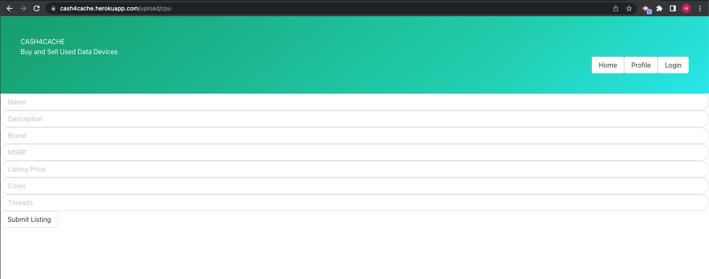

# cash4cache

## Link to Deployed Webpage 
To view the "Cash4Cache" web application, please visit the following link: https://cash4cache.herokuapp.com/


## The Task

For Project #2, we had to build a full stack ecommerce website that utilizes node.js, express.js, handlebars.js, MySQL, Sequelize ORM, GET/POST routes, authentication (express-session and cookies), API keys, all with MVC paradigm. 

## Description

Cash4Cache is a web based application that allows users to post and browse listings for used memory devices (CPUs, GPUs, and Memory Cards).

Cash4Cache was built using Express, Handlebars, JavaScript, Bulma CSS, Sessions, Sequelize, MySql, NodeMailer, Helmet, and BodyParser.


## User Story

```
AS a Computer User who shops online
I WANT to see listings for specific data devices at a discounted price
SO THAT I don’t waste my time on department store sites with infinite choices.
```


## Acceptance Criteria

```
GIVEN I am searching for data devices
WHEN I log into the site
THEN I am presented with a list of previous postings
WHEN I want to upload my own device
THEN I am able to upload and post that device
```


## Mock-Up

The following image series demonstrates the appearance and functionality of the "Cash4cache" web application:

Visitors will be shown the homepage first.


Visitors will be able to create a new account or login as an existing User.


A User can access their User Profile and view items that they have listed for sale.


From the User profile, the User can select to upload a CPU:



A Graphics Card:


Or a Memory Card:


Users can also browse listings using our search feature:


## Developing Contributors

Hayden Caffey, Brandon Cullifer, Deion Ponsones, Evan Gilmore
